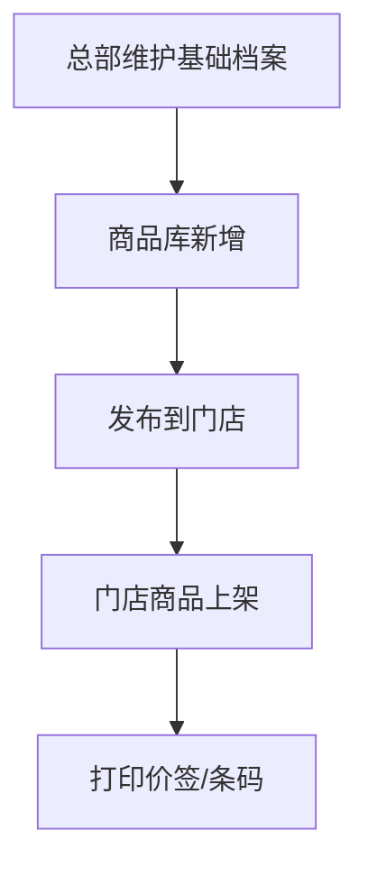

# 画原型 + 写 PRD 联合提示词（示例 / 零售连锁系统-商品管理）

> 🎯 **示例说明**：本文件展示 Capture Mode 在**场景 4（全新模块）**下用户实际填写的样子。
>
> 👤 **关键点**：用户填的内容**只是骨架**——字段名、分组、关键属性即可。具体约束规则、默认值、长度等细节不用在这里写，AI 出原型+PRD 时会按 PRD 铁律自动补全。
>
> **基于的真实 PRD**：[PRD-零售连锁系统-商品管理-正式版-2026-04-30](../../../../archive/PRD-零售连锁系统-商品管理-正式版-2026-04-30-其他提示已展开.md)

---

# 第一部分：👤 用户输入（用户填这里）

## §U1 基础信息

- 模块名：零售连锁系统-商品管理
- 业务对象：商品（多规格 + 主数据 + 门店视图）
- 目标用户：商品运营 / 门店店长店员 / 系统管理员
- 部署地区：CN
- 关联系统：统一账号中心 / 统一地区库

## §U2 场景选择

✅ 场景 4：全新模块（仅文字描述 + 菜单结构）

## §U3 参考材料

无截图，仅文字 + 菜单清单

## §U4 业务背景

- 业务问题：总部商品主数据与门店可售商品视图割裂
- 业务目标：建设主数据 + 门店经营一体化能力
- 上线时间：2026-05-20

---

# 第二部分：🤖 AI 填充（用户核对，**注意只写骨架**）

## §A1 产品形态

B 端后台系统（多门店连锁零售 ERP）。业务对象：商品。

## §A2 业务对象 + 字段（**只列骨架，约束规则 AI 自动补**）

### 2.1 商品库 - 基本信息
- 商品编号（自动）/ 商品名称（必填）/ 商品分类（必填）/ 货物类型 / 货主 / 状态

### 2.2 商品库 - 规格信息（多规格）
- 规格编号（自动）/ 规格名称（必填）/ 风味 / 尺寸 / 价格（金额，必填）/ 规格条码（必填）/ 保质期

### 2.3 门店商品
- 商品编号 / 商品名称 / 门店价格（必填）/ 门店状态 / 所属门店

### 2.4 基础档案（商品分类 / 属性 / 单位 / 品牌）
- 名称（必填）/ 编码（自动）/ 上级（分类用）/ 状态

### 2.5 价签 / 条码模板
- 模板名称（必填）/ 模板内容（可视化设计器）/ 适用范围 / 状态

> 💡 **不需要写约束规则、默认值、长度限制等** — AI 出原型+PRD 时会按 PRD 铁律自动补全（必填默认值、命名唯一性、范围、长度等都从规范库自动套用）。

## §A3 功能点

- 标准 CRUD：查询 / 新增 / 编辑 / 删除 / 启用 / 停用 / 导入 / 导出 / 复制 / 查看
- 商品库特殊：新增-无规格 / 新增-保质期 / 新增-多规格 / 发布到门店
- 业务下发（必双消息）：上架 / 下架 / 改价格 / 发布到门店
- 门店特殊：打印价签 / 打印条形码 / 批量打印
- 模板设计器：价签可视化设计器 / 条码模板设计器

## §A4 框架结构

- 顶栏：首页 / **商品**（active）/ 订单 / 入库 / 出库 / 售后 / 物流 / 财务 / 数据 / 设置
- 侧边栏：商品管理 → 商品库 / 门店商品 / 商品分类 / 商品属性 / 单位 / 品牌 / 价签管理 / 条形码管理（共 8 个三级菜单）
- 面包屑：商品 / 商品管理 / 商品库
- 页签：[首页] + [商品库 ×]

## §A5 视觉风格

团队默认（主色 #3363FF / Element Plus / 中等密度）

## §A6 交互细节（关键）

- 新增/编辑形态：**商品库跳页**（多 Tab + 规格管理复杂）；**基础档案弹窗**
- 状态机：已启用 ↔ 已停用 → 已删除（软删）
- 业务前置 4 类校验：关联依赖（删分类查商品数）/ 状态机（启用已启用拦截）/ 唯一性（同货主商品编码唯一）/ 时效（无）

## §A7 术语 + 角色 + 部署

- 业务术语：商品库 / 门店商品 / 货主 / 商品编码 / 规格弹窗 / 软删除
- 角色：商品运营 / 门店店长 / 门店店员 / 系统管理员
- 部署：CN / ¥ / UTC+8

## §A8 非功能（业务背景里明确的）

- 性能：列表 50ms / 1000 条；1000 TPS
- 安全：编码字段防 SQL 注入 + XSS；操作日志含旧→新值

## §A9 业务流程图

## §A10 ⚠️ 不确定的点

1. 商品编号前缀规则：SPU+10位流水号？还是其他？
2. 门店店员是否有改价权限？
3. 保质期临期预警：本期是否含？
4. 数据恢复入口：哪个角色有权限？
5. 发布到门店批量上限：多少？

## §∞ 场景 4 扩展：业务背景（已在 §U4 填）

---

# 第三部分：🤖 AI 侧约束（用户不用读）

引用 v1-master-spec.md / prd-data-schema.md §8 / annotation-templates.md / _rules/prd-template-structure.mdc。

---

## 👤 用户核对清单

- [ ] §A1-§A9 骨架对了
- [ ] §A10 不确定点逐项澄清

**确认句式**：
- "全部 OK，按这个画" → AI 出原型 + PRD（细节自动补）
- "§AX 改 Y" → AI 更新

---

## 关键提示（给将来的用户）

| 你不用写 | AI 自动补 |
|---|---|
| 字段约束（如"1~30 字符"/"同体系唯一"）| ✅ 按 PRD 铁律补 |
| 默认值（如"空"/"已启用"）| ✅ 按业务惯例默认值库补 |
| 命名规则细节 | ✅ 按部署地区 + 业务对象类型补 |
| 提示消息文案 | ✅ 按 §4.5 字段表自动生成 |
| 状态机 Tag 颜色 | ✅ 按团队设计 token 补 |

**你只需要写"业务骨架"——字段名 + 类型 + 必填即可。剩下交给 AI 和 PRD 铁律。**
