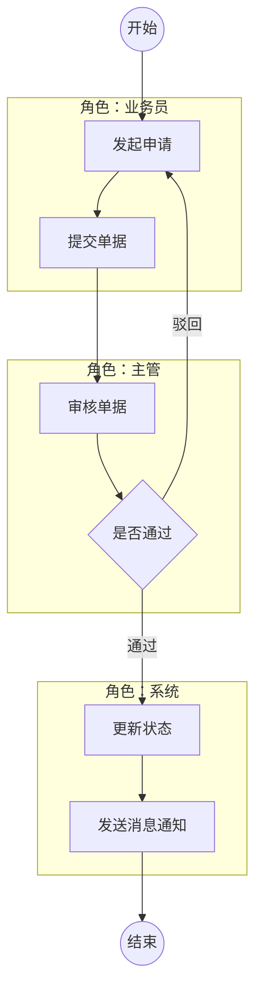

# PRD 模板（基础资料、客户、商品）

> 按《基础资料、客户、商品》文档结构编排。  
> 本版按现网操作裁剪：只保留真实操作，不使用 `N/A` 占位。
> 说明：`运营管理端/货主管理端` 仅为系统视图示例名，写 PRD 时必须以用户实际提示词定义系统与角色。
> 说明：模板中的菜单名称（如 `基础设置/仓库管理/库区管理/部门管理/人员管理/客户管理/商品管理/操作记录/财务管理/账户余额/充值管理/售后管理/创建退货单/退货管理`）均为示例，必须按用户实际提示词替换。
> 说明：是否需要“独立系统视图”章节（如 4.4/4.5）取决于本次提示词；若仅提供单系统视图，则只输出单视图结构，不强制拆分为两端。
> 说明：全文请使用清晰、易懂、低歧义语言；优先短句，术语首次出现需给出简明解释。
> **完整不合并（用户明确要求时，与 `SKILL.md`、`prd-template-structure.mdc`、提示词模板一致）：**须**逐菜单、逐功能点**写全「位置 / 原型图 / 字段规范 / 用例规则」等小节与表格；**禁止**「同上」「参见某节」「以下略」「表格同上」「合并展示」「复用前文代替」「从略」等任何形式的合并或省略；即使用例规则或字段规范与其它功能点**逐字相同**，也须在**每一个**功能点下**完整重写一遍**。此模式下**不适用**单行「`请参考：<对照功能点编号> <对照功能点名称>`」省略，直至用户明确允许引用。**禁止**跨菜单把多个功能点收成一段。若单次对话框或文档篇幅装不下，**须分多条/多段**续写，**禁止**以合并或省略代替未输出部分。

## 1 开发目的

- 项目/需求名称：`<名称>`
- 建设目标：`<主要实现目标>`
- 业务价值：`<业务价值/收益>`
- 核心问题：`<待解决问题>`

## 2 版本变更

> 4 列固定（§1.4）：`版本 / 日期 / 变更人 / 变更内容`；版本号 `vX.Y`；日期 `YYYY-MM-DD`；变更内容含具体模块名 + 动词领起。

| 版本 | 日期 | 变更人 | 变更内容 |
|---|---|---|---|
| v1.0 | `<YYYY-MM-DD>` | `<姓名或账号>` | `<首次发版：覆盖商品库、门店商品等 X 个模块>` |

## 3 术语 / 图例定义

> 2 列固定（§1.5）：`术语 / 定义`；按 PRD 涉及动作 trigger 必含术语（软删除 / 唯一性校验 / 状态机 / 二次确认弹窗 / 异步任务 / 双消息 / 回显 / 条件必填 等）。

| 术语 | 定义 |
|---|---|
| 软删除 | 数据从列表移除但不物理删除；标记 `is_deleted=true`；保留可追溯。 |
| 唯一性校验 | 在指定业务范围内（同货主下、同分类下等）唯一，新增/编辑时校验。 |
| `<其它术语>` | `<定义>` |

## 4 功能需求

### 4.1 产品定义

- 功能定位：`<定位>`
- 目标用户：`<用户角色>`
- 业务范围：`<范围边界>`

### 4.2 产品框架

- 页面/菜单结构：`<结构说明或链接>`
- 角色权限：`<角色与权限>`
- 模块关系：`<上下游关系>`

### 4.3 业务流程图

- 主流程图：`必须按泳道角色绘制，覆盖端到端关键节点与跨角色交互`
- 子流程图：`必须按泳道角色绘制，按场景拆分（如新增、编辑、审核、异常处理）`
- 泳道角色清单：`<角色A>`、`<角色B>`、`<角色C>`、`系统`
- 绘制规范：
  - `每个泳道仅放本角色动作，跨角色流转必须有明确连线与触发条件`
  - `所有判断节点写清条件（如：通过/驳回、库存充足/不足）`
  - `每个流程场景必须包含开始节点与结束节点（开始/结束不可省略）`
  - `主流程图命名：主流程-<模块名>`；`子流程图命名：子流程-<模块名>-<场景名>`
  - `如分运营管理端与货主管理端，需分别出图，不混画在同一泳道图中`
- Mermaid泳道示例（可替换为实际角色与步骤）：

<!-- 仅多系统视图时追加 4.3.x 系统视图边界节；单系统视图省略该节，业务边界并入 4.3 业务流程图 描述。
     多系统视图时按以下骨架填写： -->

<!--
### 4.3.1 系统视图边界（仅多系统视图）

- 视图定义：<视图A> 与 <视图B> 是两个独立系统视图（按用户实际命名替换，禁止套用占位）。
- 编写规则：同名模块按各视图分别描述，不默认复用功能、字段、权限与提示文案。
- 边界要求：如存在跨视图协同，仅描述交互边界（消息、接口、状态同步），不混写视图内细节。
- 模板优先级：本模板仅为骨架，具体功能点、字段、流程、文案以用户提示词与图片为准。
-->

### 4.4 `<系统视图名称>`

<!-- 单系统视图：本节即唯一系统视图；多系统视图：本节为第一端，后续追加 4.5 / 4.6 ... 各端。
     系统视图名称、菜单名、功能点名一律取用户当次输入的真实命名，禁止套用示例占位。 -->

- 描述本视图下全部菜单、权限、流程、字段与日志规则。

#### 4.4.1 `<系统菜单名称>`

##### 4.4.1.1 `<二级菜单名称>`

位置  
  `<系统视图>-<系统菜单>-<二级菜单>`
原型图  
  `<图片编号或"无"，如 IMG-01>`

<!-- 按用户实际菜单结构动态展开。如有更多二级菜单，复制 ##### 4.4.1.x 模块；
     如有更多系统菜单，复制 #### 4.4.x；如有多系统视图，复制整段 ### 4.4 改 4.5 / 4.6。 -->

---

<!-- ============================================================
     以下「功能点明细填写示意」**不作为 PRD 输出章节**，仅为 AI 填空参考。
     PRD 固定 4 章；功能点直接挂在第 4 章对应末级菜单（##### 4.4.x.y）下，
     标题层级为 `###### 4.4.x.y.z <功能点名>`。
     严禁另起「## 5 功能点明细」章节。
     ============================================================ -->

## 功能点明细填写示意（AI 填空参考，不作为 PRD 输出章节）

- 模块层规则：在末级菜单层（如 `##### 4.4.1.1 仓库管理`）下，必须先写模块级 `位置` / `原型图` 两段（两行式：标签独占一行、其后不加「：」，内容写下一行），再展开功能点；**禁止**写 `• 操作清单：`（与紧随的 `###### 4.4.x.y.z` 标题重复）。
- 编写位置：功能点直接挂在末级菜单节点下（如 `##### 4.4.1.1 仓库管理` 下紧跟 `###### 4.4.1.1.1 新增`）。
- 编号规则：编号层级按实际菜单结构动态生成，不使用固定层级编号。
- 子项示例：若功能点编号为 `4.4.1.1.1`，则依次写为 `4.4.1.1.1.1 位置`、`4.4.1.1.1.2 原型图`、`4.4.1.1.1.3 字段规范`、`4.4.1.1.1.4 用例规则`。
- 去重规则：功能点小节内不重复写“系统视图/所属系统菜单/功能点名称”。
- **说明**：上述「去重」仅指不写重复的章首三项标签；**不表示**允许把不同功能点的 `字段规范` / `用例规则` 合并成一段或以「参见上文」代替。用户要求「完整不合并」时，每个功能点仍须独立写全各小节（见文首「完整不合并」说明）。

### `<模块编号> <模块名称>`

位置  
  `<一级菜单>-<二级菜单>`
原型图  
  `<原型图链接或截图说明>`

### `<功能点编号> <功能点名称>`

### `<模块编号> <模块名称>`

位置  
  `<一级菜单>-<二级菜单>`
原型图  
  `<原型图链接或截图说明>`

### `<功能点编号> <功能点名称>`

### `<模块编号> <模块名称>`

位置  
  `<一级菜单>-<二级菜单>`
原型图  
  `<原型图链接或截图说明>`

### `<功能点编号> <功能点名称>`

### `<模块编号> <模块名称>`

位置  
  `<一级菜单>-<二级菜单>`
原型图  
  `<原型图链接或截图说明>`

### `<功能点编号> <功能点名称>`

### `<模块编号> <模块名称>`

位置  
  `<一级菜单>-<二级菜单>`
原型图  
  `<原型图链接或截图说明>`

### `<功能点编号> <功能点名称>`

### `<功能点编号>.1 位置`

位置  
  `<菜单路径>`

### `<功能点编号>.2 原型图`

原型图  
  `<链接或截图说明>`

### `<功能点编号>.3 字段规范`

字段规范表**固定五列表头**（与 `prd-template-structure.mdc §3.1` 一致）：

| 字段名称 | 类型 | 是否必填/必选 | 默认值 | 约束规则 |
|---|---|---|---|---|
| `<字段A>` | `<文本/下拉/单选/复选/上传/日期/数值/…>` | `<是/否/条件必填>` | `<请输入<字段名>/请选择/回显/无/空/具体值>` | `<格式/唯一性/范围/枚举值/防注入 等>` |

- `查询`：`字段规范` 固定拆为「**1、查询条件**」「**2、列表字段**」两节，每节各用上述五列表（查询条件默认非必填；文本默认空、下拉默认「全部」、时间范围按业务定义等）。  
- `查看`：只读口径，默认值写「回显」；与 `查询` 的拆分边界按工作区规则执行。  
- `新增` / `编辑`：默认值列中的「请输入…」「请选择」字段名须与本表「字段名称」列逐字一致；`编辑` 默认值统一写「系统回填已保存值」。
- **纯操作类无字段规范**（删除 / 导出 / 启停 / 打印 / 复制 等，无数据录入控件）：`.3 字段规范` 节直接**写「无」**（与「原型图」空值写「无」一致），不省略、不跳节；用例规则固定 `.4`。

### `<功能点编号>.4 用例规则`

<!-- 七项标题行须顶格（用例规则不含「留痕要求」独立一行）：行首为 Unicode `•`（U+2022）+ 半角空格；`•` 前禁止普通空格、制表符、NBSP（U+00A0）或其它空白。-->

<!-- 【分条编号规则 · 2026-06-24 新增】前置条件 / 后置条件 / 校验规则 三节：仅一条内容时写成一段（内联，元素用 `；` 或 `、` 分隔）；**超过一条时改用全角 `1、2、3、` 分条编号、每条独占一行**，更清晰易读。操作流程 不论几步始终用 `1、2、3、` 编号。提示消息/消息通知/操作日志 用表格，不适用本编号规则。 -->
<!-- 示例（前置条件三要素，超过一条→编号）：
• 前置条件：
  1、用户已登录 OMS 客户端；
  2、具备「财务-财务管理-充值管理-删除」操作权限；
  3、充值管理列表中存在状态为「待审核」或「已驳回」的充值单（其它状态不可删除）。
-->

• 前置条件：`<状态、权限、数据准备>`
• 操作流程：
  1、`<步骤1>`
  2、`<步骤2>`
  3、`<步骤3>`
  4、`用户点击“取消”，系统将不进行任何操作`
• 后置条件：`<状态变化、数据变化、单据流转结果>`
• 校验规则：
  `统一句式（每条可单测）：当<触发条件>时，若<拦截条件>，则<处理动作>并提示“<文案>”，系统<失败后行为>。`
  `职责边界：本节仅写跨字段 / 状态 / 权限 / 业务逻辑 / 异常类校验；字段级校验（必填/格式/长度/唯一性/范围/防注入）一律由 §4.5 提示消息表承载，不在此重复。`
  `示例 A（跨字段）：当用户点击保存时，若<开始时间>晚于<结束时间>，则拦截提交并提示“开始时间不得晚于结束时间”，系统不落库。`
  `示例 B（状态）：当用户点击下架时，若所选数据中存在已下架记录，则拦截并提示“所选数据已包含下架状态记录，请重新选择”，系统不更新任何数据。`
  `示例 C（权限）：当用户点击新增时，若当前角色无“<模块>-新增”权限，则拦截并提示“无权限执行此操作”，系统不展示新增入口。`
  `示例 D（业务逻辑）：当用户点击保存时，若所选商品分类已被停用，则拦截提交并提示“所选分类已停用，请重新选择”，系统不落库。`
  `示例 E（异常）：当系统检测到 5 秒内同一用户重复提交时，则拦截后续提交并提示“请勿重复提交”，仅保留首次成功记录。`
  `若本功能点无任何非字段级校验，写：字段级校验见提示消息表；本功能点无跨字段、状态、权限、业务逻辑或异常类校验。`
• 提示消息：`若有内容请使用字段表；无则写“无。”；适用于保存/提交/继续/下一步等进入下一步动作的校验提示`
  `在当前页面的字段下面红色字体提示：`
  提示消息字段表（有内容时）：

| 字段名称 | 未填写/未选择提示 | 输入错误提示 |
|---|---|---|
| `<字段名称A>` | `<请输入/请选择...>（非必填字段填 -）` | `<长度限制/唯一性/格式校验等提示>` |

`（详见 prd-template-structure.mdc §4.5：「未填写/未选择提示」仅对必填/条件必填字段填「请输入/请选择<字段名>」且<字段名>与「字段名称」列一字不差，非必填字段填 `-`；「输入错误提示」对所有有约束字段写可校验提示（格式/长度/唯一性/范围/枚举/防注入），按字段规范约束规则逐条触发；纯选择类+必填=否 → 不进表；禁止汇总/占位行。）`

• 消息通知：`无。`
  消息通知字段表（有内容时）：

| 字段 | 字段说明 | 规则/示例 |
|---|---|---|
| 接收人 | 消息接收对象（角色/岗位/人群） | 例如：`门店店长、门店运营` |
| 消息标题 | 面向接收人的功能点通知 | 例如：`新增客户成功通知` |
| 消息内容 | 面向接收人的结果通知文案 | 模板：`<业务动作>已完成，请到<页面/模块>查看` |

• 操作日志：用户操作成功后，系统在操作日志模块记录：操作时间、操作账号、操作模块、操作功能、操作明细、IP地址。

| 字段 | 字段说明 | 规则/示例 |
|---|---|---|
| 操作时间 | 操作发生时间 | 精确到：`年月日时分秒`，格式：`YYYY-MM-DD HH:mm:ss` |
| 操作账号 | 登录系统的账号名称 | 例如：`zhangsan` |
| 操作模块 | 具体菜单名称 | 例如：`财务-发票管理-全部-近期发票` |
| 操作功能 | 本次操作触发的功能动作名称 | 例如：`取消发票/开退票/导出XML` |
| 操作明细 | 本次操作的详细信息 | 格式 `<动作><对象类型>：<对象唯一标识>=<值>[，<动作详情>]`；必含对象唯一标识；编辑类含旧值→新值；批量类含统计（共 N 件 / 成功 X 条失败 Y 条）；禁含敏感信息；示例：`编辑商品：编号=SPU001234，售价：¥3.5→¥4.0`（按本功能点动作类型选写具体业务示例值） |
| IP地址 | 触发操作的客户端IP | 例如：`192.168.1.10` |
